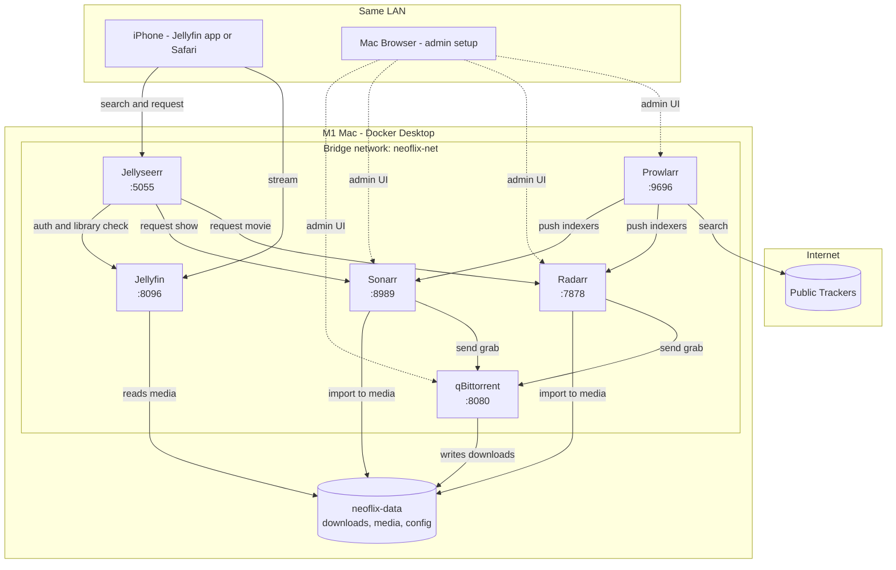
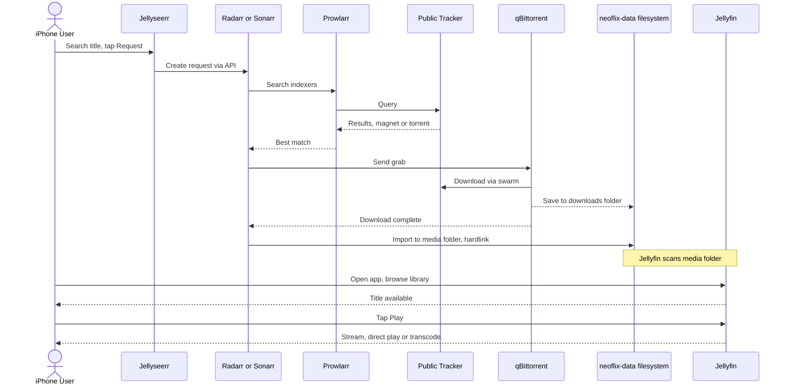

# neoflix — High-Level Design

Visual companion to [DESIGN_DECISIONS.md](DESIGN_DECISIONS.md) — this file
shows the *shape* of the system; the decisions log has the *why* behind each
piece. Don't duplicate rationale here — if a diagram raises a "why is it
built this way" question, the answer belongs in DESIGN_DECISIONS.md, not
repeated in this file.

## Architecture

(Bridge network is decision #5, the shared `neoflix-data` mount is
decision #1 — see DESIGN_DECISIONS.md.)

Notes:
- Solid arrows are the runtime request/data flow; dotted arrows are one-off
  admin/setup access (story 1–4 in USER_STORIES.md), not something an end
  user touches.
- `qBittorrent`, `Radarr`, and `Sonarr` all mount the **same** `neoflix-data`
  parent (not separate volumes) — this is the hardlink requirement from
  decision #1, shown here as one shared volume rather than three.
- No VPN/gluetun node — decision #3 explicitly excludes it for the POC.
- Public trackers are reached directly from Prowlarr (search) and
  qBittorrent (swarm download) with no tunnel in between.

## Request → download → play flow

(Import uses a hardlink per decision #1; Jellyfin's scan is story 6 in
USER_STORIES.md.)

Maps directly onto [USER_STORIES.md](USER_STORIES.md): the request half
(stories 2–4) is `Claude`-drivable via each app's API; the playback half
(stories 7–8) is the `[You]`-only iPhone portion, since it's the one leg no
API can stand in for.
