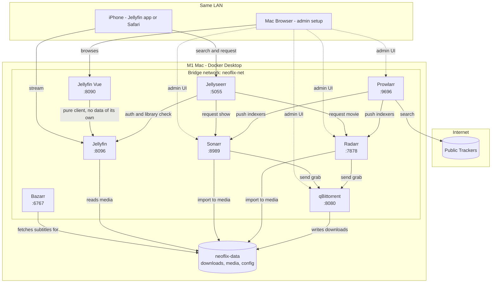
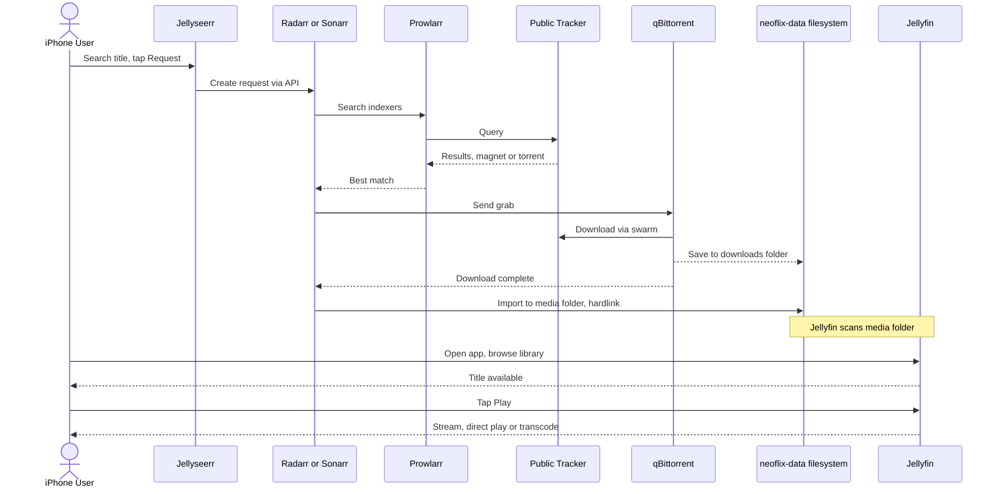
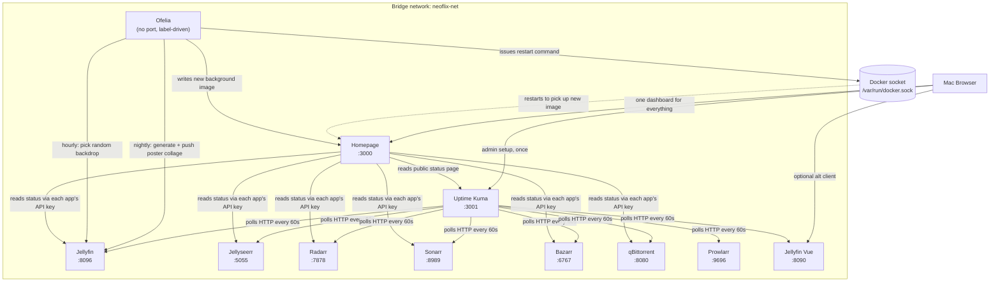

# neoflix — High-Level Design

Visual companion to [DESIGN_DECISIONS.md](DESIGN_DECISIONS.md) — this file
shows the *shape* of the system; the decisions log has the *why* behind each
piece. Don't duplicate rationale here — if a diagram raises a "why is it
built this way" question, the answer belongs in DESIGN_DECISIONS.md, not
repeated in this file.

## Architecture

(Bridge network is decision #5, the shared `neoflix-data` mount is
decision #1 — see DESIGN_DECISIONS.md.)

Notes:
- Solid arrows are the runtime request/data flow; dotted arrows are one-off
  admin/setup access (story 1–4 in USER_STORIES.md), not something an end
  user touches.
- `qBittorrent`, `Radarr`, and `Sonarr` all mount the **same** `neoflix-data`
  parent (not separate volumes) — this is the hardlink requirement from
  decision #1, shown here as one shared volume rather than three.
- No VPN/gluetun node — decision #3 explicitly excludes it for the POC.
- Public trackers are reached directly from Prowlarr (search) and
  qBittorrent (swarm download) with no tunnel in between.
- Homepage, Ofelia, and Uptime Kuma (decisions 9-11) are left off this
  diagram — they don't participate in the request→download→play flow shown
  here, see the "Dashboard, scheduling & monitoring" diagram below instead.

## Request → download → play flow

(Import uses a hardlink per decision #1; Jellyfin's scan is story 6 in
USER_STORIES.md.)

Maps directly onto [USER_STORIES.md](USER_STORIES.md): the request half
(stories 2–4) is `Claude`-drivable via each app's API; the playback half
(stories 7–8) is the `[You]`-only iPhone portion, since it's the one leg no
API can stand in for.

## Dashboard, scheduling & monitoring

The optional add-ons from decisions 9-11. None of these sit in the
request→download→play path above — they're operational tooling layered on
top of it.

Notes:
- Ofelia has no web UI and isn't reachable itself — it acts entirely
  through the Docker socket (to restart Homepage after a background change)
  and the Jellyfin API (to read/write images). Configured via labels on its
  own container, not a separate config file.
- Homepage's API-key reads are one-way (dashboard pulling status) — it
  never writes to any of the apps it displays.
- Uptime Kuma polls independently of Homepage; Homepage only reads Kuma's
  public status page, it doesn't talk to the monitored apps on Kuma's
  behalf.
