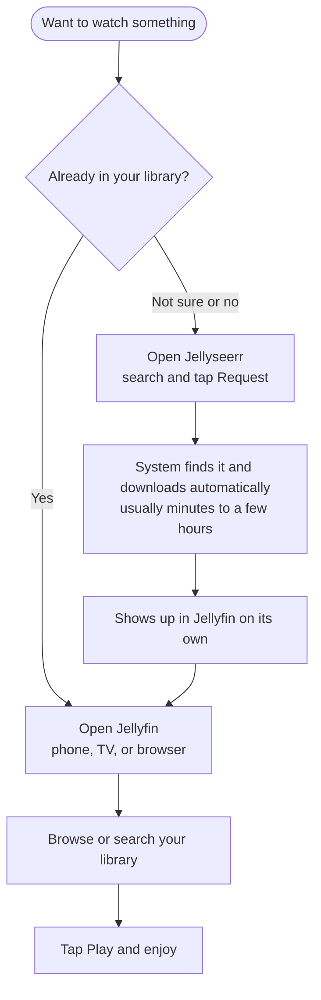

# neoflix

Self-hosted media server: automated movie/show acquisition + Jellyfin
streaming, running in Docker. Currently a POC on an M1 Mac, validated against
one movie and one show episode before any real usage.

## How you'll actually use it

Once set up, day-to-day usage only ever touches two apps — Jellyfin to
watch, Jellyseerr to request something new:



Everything else in the stack (Radarr, Sonarr, Prowlarr, qBittorrent,
Bazarr) runs invisibly in the background — see [HLD.md](HLD.md) for that
side of the flow.

## Status

**Design complete, POC not yet validated.** All 13 architecture decisions are
made and `docker-compose.yml` exists — see [DESIGN_DECISIONS.md](DESIGN_DECISIONS.md)
for the full log. Next step is bringing the stack up and working through
[USER_STORIES.md](USER_STORIES.md).

## Docs

New to this project and just want it running? Start with
**[SETUP.md](SETUP.md)** — a self-contained, step-by-step walkthrough from a
fresh machine using only `docker-compose.yml`.

For the deeper context, read in this order:

1. [GOALS.md](GOALS.md) — what this is for, scope, non-goals, constraints.
2. [DESIGN_DECISIONS.md](DESIGN_DECISIONS.md) — every architecture decision
   made, in priority order, with rationale and what was deferred. The source
   of truth for "why is it built this way."
3. [HLD.md](HLD.md) — architecture and request-flow diagrams (mermaid);
   the visual shape of the system.
4. [USER_STORIES.md](USER_STORIES.md) — manual test plan for validating the
   POC once it's running, tagged by who performs each step (Claude vs. you).

## Stack

One Docker bridge network, no VPN for the POC. Core acquisition/playback
pipeline (decisions 1-8):

- **Jellyfin** — media server / playback
- **Radarr** — movie acquisition automation
- **Sonarr** — TV show acquisition automation
- **Prowlarr** — indexer management (public trackers)
- **qBittorrent** — download client
- **Jellyseerr** — unified search/request UI in front of Radarr/Sonarr/Jellyfin
- **Bazarr** — automatic subtitles

Optional extras added on top since (decisions 9-12), not needed for the
core pipeline to work:

- **Homepage** — one dashboard with links + live widgets for everything
  above (`scripts/bootstrap.sh` writes a starting version — see SETUP.md)
- **Ofelia** — background scheduler; rotates Homepage's background hourly
  and regenerates library poster art nightly, both via the Jellyfin API
- **Uptime Kuma** — monitors every web-facing service, feeds Homepage's
  status widget
- **Jellyfin Vue** — optional alternative Jellyfin web client (unstable
  upstream builds only)

All of the above, plus the core pipeline's account/connection setup, is
what `scripts/bootstrap.py` automates (decision #13) — see SETUP.md.

Full rationale for each piece, and what was deliberately left out (VPN,
Lidarr/Readarr/comics), is in DESIGN_DECISIONS.md.

## Data layout

Media, downloads, and app config all live outside this repo, at
`~/neoflix-data/` — see decision #1 in DESIGN_DECISIONS.md for the full
structure and why it's kept separate from the git-tracked project folder.

## Running it

```sh
cp .env.example .env                       # adjust PUID/PGID/TZ/DATA_ROOT if needed
cp credentials.env.example credentials.env # fill in an admin login (decision #13)
scripts/bootstrap.sh                       # creates folders, starts the stack, wires everything up
```

That last command replaces what used to be a long list of manual per-app
setup steps — see [SETUP.md](SETUP.md) for the full walkthrough (and its
manual-setup appendix, if you'd rather click through it yourself).

Then work through [USER_STORIES.md](USER_STORIES.md) to validate the
pipeline and playback on iPhone.
